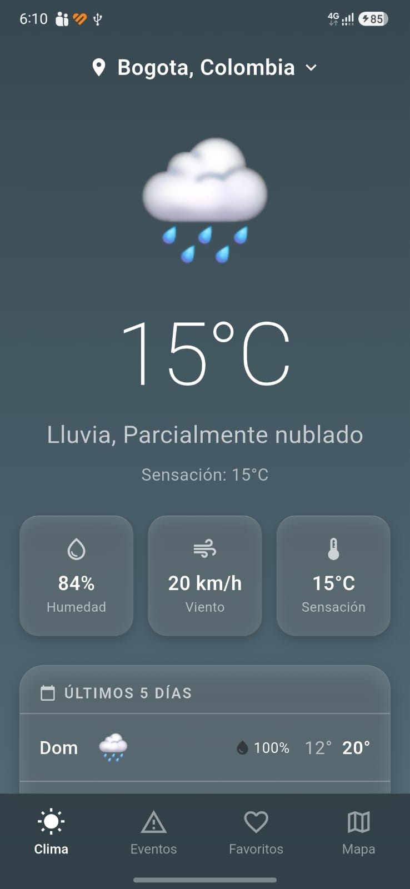
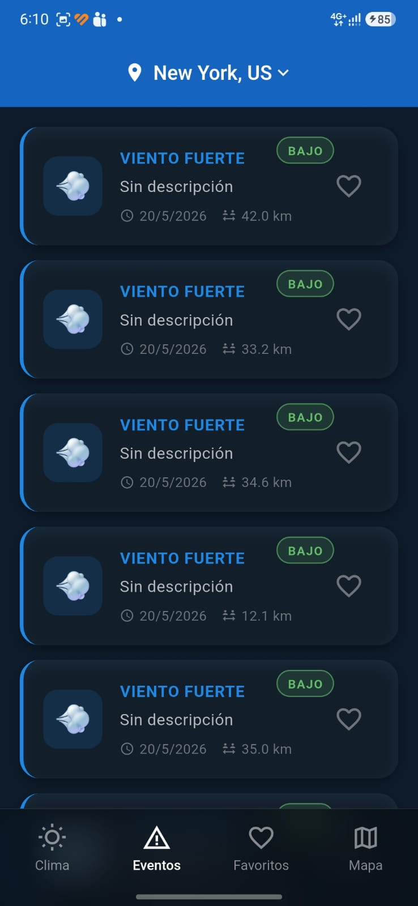
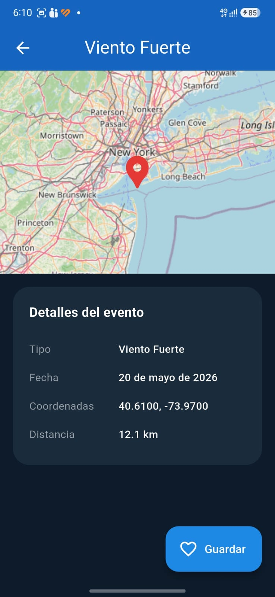
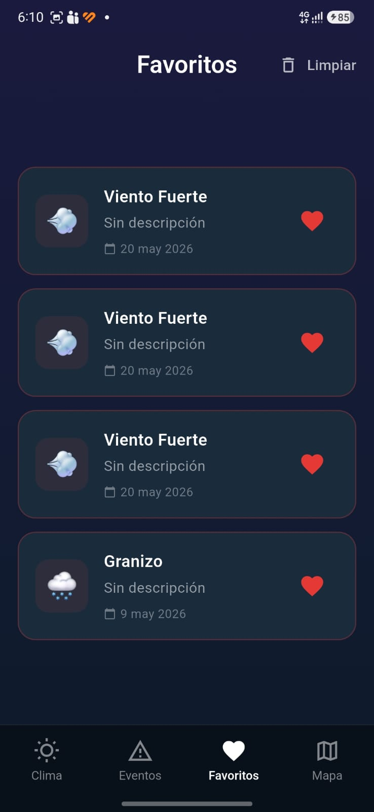
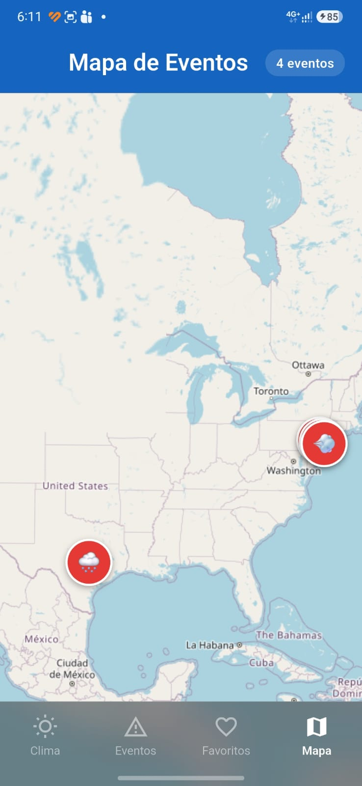
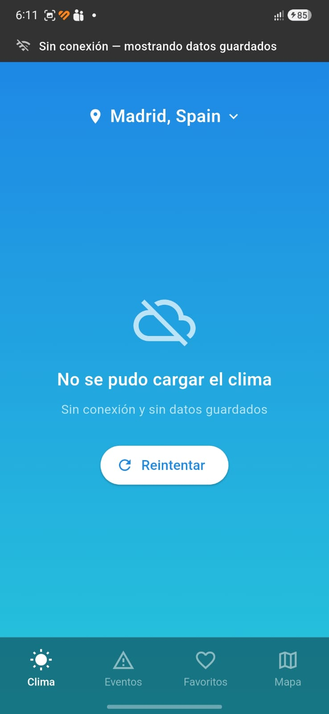

# Weather App

Aplicación móvil desarrollada en Flutter como prueba técnica para vacante de Flutter Developer. Consume la API de [VisualCrossing Timeline Weather](https://www.visualcrossing.com/resources/documentation/weather-api/timeline-weather-api/) para mostrar eventos climáticos y el pronóstico de los últimos 5 días basado en la ubicación del usuario.

---

## Tabla de contenidos

- [Capturas de pantalla](#capturas-de-pantalla)
- [Características](#características)
- [Arquitectura](#arquitectura)
- [Estructura del proyecto](#estructura-del-proyecto)
- [Tecnologías y dependencias](#tecnologías-y-dependencias)
- [Requisitos previos](#requisitos-previos)
- [Instalación](#instalación)
- [Configuración de flavors](#configuración-de-flavors)
- [Ejecución](#ejecución)
- [Variables de entorno y API Key](#variables-de-entorno-y-api-key)
- [Decisiones técnicas](#decisiones-técnicas)
- [Testing](#testing)
- [Estado del proyecto](#estado-del-proyecto)
- [Autor](#autor)

---

## Capturas de pantalla

> Ejecutar con `flutter run --flavor dev -t lib/main_dev.dart` para reproducir estas vistas.









---

## Características

- **Eventos climáticos** — lista y detalle de eventos como granizo, tornados, vientos y terremotos, basados en la ubicación del usuario.
- **Clima últimos 5 días** — condición actual y pronóstico diario de los últimos 5 días con métricas de humedad, viento y sensación térmica.
- **Geolocalización** — detección automática de la ubicación del dispositivo (GPS) con resolución del nombre de ciudad vía geocoding. Incluye opción de búsqueda manual y ciudades sugeridas.
- **Favoritos** — el usuario puede agregar y eliminar eventos favoritos, persistidos localmente con Realm. El estado se propaga reactivamente con Riverpod.
- **Modo offline** — detección de conectividad en tiempo real. Sin conexión, la app notifica al usuario mediante un banner y presenta la última información cacheada localmente en Realm.
- **Vista de mapa** — coordenadas de eventos presentadas en un mapa interactivo con Flutter Map y tiles de OpenStreetMap, sin dependencia de Google Maps API.
- **Flavors Dev / Prod** — dos ambientes con nombre de app, ícono y API key diferenciados, disponibles en Android e iOS.
- **Idioma español y sistema métrico** — toda la información se presenta en español con unidades métricas (°C, km/h, mm).

---

## Arquitectura

La aplicación implementa una **Clean Architecture simplificada**, organizada por features (Feature-First). Se omitió la capa de Use Cases de forma consciente: dado el alcance de esta prueba, la lógica de negocio reside en los repositorios y añadir Use Cases habría introducido complejidad sin aportar valor real.

```
Presentation  →  Domain  →  Data
(Riverpod)       (Entities    (DTOs · DataSources ·
                  + Repos)     RepoImpl · Realm)
```

### Flujo de datos

```
UI (Screen)
    │
    ▼
Riverpod Notifier (AsyncNotifier)
    │
    ▼
Repository Interface (Domain)
    │
    ├──► RemoteDataSource → Dio → VisualCrossing API
    │                              │
    │                              ▼
    │                         Guardar en Realm (caché)
    │
    └──► LocalDataSource → Realm (modo offline)
```

### Principios aplicados

- **Separación de responsabilidades** — cada capa conoce solo la que tiene debajo de ella.
- **Inversión de dependencias** — la presentación y los datos dependen de interfaces del dominio, no de implementaciones concretas.
- **Inmutabilidad del estado** — las entidades usan `copyWith` y Riverpod gestiona el estado con `AsyncNotifier`.
- **Manejo de errores tipado** — se usa `Either<Failure, T>` de `fpdart` en lugar de excepciones no controladas, evitando try/catch dispersos en la UI.
- **Resultados tipados con sealed classes** — el `LocationService` usa sealed classes de Dart 3 para modelar todos los posibles estados del GPS sin depender de excepciones.

---

## Estructura del proyecto

```
lib/
├── core/
│   ├── config/          # FlavorConfig · AppConfig
│   ├── constants/       # ApiConstants
│   ├── errors/          # AppException · Failure (sealed class)
│   ├── network/         # ApiClient (Dio) · ConnectivityService · interceptores
│   ├── providers/       # location_provider (Riverpod)
│   ├── services/        # LocationService (GPS + geocoding)
│   ├── storage/         # RealmDb (inicialización y singleton)
│   ├── theme/           # AppTheme · AppColors
│   ├── utils/           # DateFormatter · WeatherIconMapper
│   └── widgets/         # AppShell (navegación global) · OfflineBanner
│
├── features/
│   ├── weather/                    # Pantalla últimos 5 días
│   │   ├── data/
│   │   │   ├── datasources/        # WeatherRemoteDS · WeatherLocalDS
│   │   │   ├── dtos/               # WeatherResponseDto · DayForecastDto
│   │   │   └── repositories/       # WeatherRepositoryImpl
│   │   ├── domain/
│   │   │   ├── entities/           # WeatherEntity · DayForecastEntity · CurrentConditionsEntity
│   │   │   └── repositories/       # IWeatherRepository
│   │   └── presentation/
│   │       ├── providers/          # WeatherNotifier
│   │       └── screens/            # WeatherScreen
│   │
│   ├── events/                     # Pantalla de eventos climáticos
│   │   ├── data/
│   │   │   ├── datasources/        # EventsRemoteDS · EventsLocalDS
│   │   │   ├── dtos/               # EventsResponseDto
│   │   │   └── repositories/       # EventsRepositoryImpl
│   │   ├── domain/
│   │   │   ├── entities/           # EventEntity
│   │   │   └── repositories/       # IEventsRepository
│   │   └── presentation/
│   │       ├── providers/          # EventsNotifier
│   │       └── screens/            # EventsScreen · EventDetailScreen
│   │
│   ├── favorites/                  # Gestión de favoritos con persistencia
│   │   ├── data/
│   │   │   ├── datasources/        # FavoritesLocalDS
│   │   │   └── repositories/       # FavoritesRepositoryImpl
│   │   ├── domain/
│   │   │   ├── entities/           # FavoriteEntity
│   │   │   └── repositories/       # IFavoritesRepository
│   │   └── presentation/
│   │       ├── providers/          # FavoritesNotifier
│   │       └── screens/            # FavoritesScreen
│   │
│   └── map/                        # Vista de mapa con coordenadas
│       └── presentation/
│           └── screens/            # MapScreen
│
├── app.dart             # MaterialApp + GoRouter
├── main_dev.dart        # Entry point — flavor dev
└── main_prod.dart       # Entry point — flavor prod

assets/
├── icons/               # Íconos por flavor (dev / prod)
└── images/              # Recursos gráficos compartidos

docs/
└── architecture.md      # Documentación extendida de arquitectura
```

---

## Tecnologías y dependencias

| Categoría | Paquete | Versión | Propósito |
|---|---|---|---|
| Estado / DI | `flutter_riverpod` | ^2.5.1 | Gestión de estado reactivo |
| Estado / DI | `riverpod_annotation` | ^2.3.5 | Code generation para providers |
| Navegación | `go_router` | ^13.2.0 | Routing declarativo |
| Red | `dio` | ^5.4.3 | Cliente HTTP con interceptores |
| Red | `connectivity_plus` | ^6.0.3 | Detección de conectividad en tiempo real |
| Persistencia | `realm` | ^20.0.0 | Base de datos local (caché offline + favoritos) |
| Ubicación | `geolocator` | ^11.0.0 | GPS del dispositivo con manejo de permisos |
| Ubicación | `geocoding` | ^3.0.0 | Conversión de coordenadas a nombre de ciudad |
| Mapas | `flutter_map` | ^6.1.0 | Mapa interactivo con OpenStreetMap |
| Mapas | `latlong2` | ^0.9.0 | Tipos de coordenadas para flutter_map |
| Errores | `fpdart` | ^1.1.0 | `Either<Failure, T>` para manejo funcional de errores |
| Utilidades | `intl` | ^0.19.0 | Formateo de fechas en español |
| Utilidades | `uuid` | ^4.3.3 | IDs únicos para entidades de favoritos |
| UI | `cached_network_image` | ^3.3.1 | Imágenes con caché automático |
| UI | `flutter_svg` | ^2.0.10 | Íconos meteorológicos en SVG |
| UI | `gap` | ^3.0.1 | Espaciado consistente entre widgets |

**Dev dependencies:** `build_runner`, `riverpod_generator`, `mocktail`, `flutter_lints`, `custom_lint`, `riverpod_lint`, `flutter_launcher_icons`.

---

## Requisitos previos

- Flutter SDK `>=3.0.0`
- Dart SDK `>=3.0.0`
- Android Studio o VS Code con extensión Flutter
- Xcode 15+ (solo para compilar en iOS, requiere macOS)
- API key gratuita de [VisualCrossing](https://www.visualcrossing.com/sign-up)

Verificar instalación:

```bash
flutter doctor
```

---

## Instalación

```bash
# 1. Clonar el repositorio
git clone https://github.com/Diland-sketch/flutter-weather-app-tech-test.git
cd weather_app

# 2. Instalar dependencias
flutter pub get

# 3. Ejecutar el generador de código (Riverpod + Realm)
dart run build_runner build --delete-conflicting-outputs
```

> **Nota:** El paso 3 es obligatorio. Sin él, los providers generados por `riverpod_annotation` y los modelos de Realm no estarán disponibles y la app no compilará.

---

## Configuración de flavors

La aplicación tiene dos ambientes: **dev** y **prod**. Cada uno tiene nombre de app, ícono y API key diferenciados.

### Android

La configuración está en `android/app/build.gradle`:

```kotlin
flavorDimensions += "environment"

productFlavors {
    create("dev") {
        dimension = "environment"
        applicationIdSuffix = ".dev"
        versionNameSuffix = "-dev"
        resValue("string", "app_name", "Weather Dev")
    }
    create("prod") {
        dimension = "environment"
        resValue("string", "app_name", "Weather")
    }
}
```

Los íconos por flavor se ubican en:

```
android/app/src/dev/res/mipmap-*/    ← icono sin relleno
android/app/src/prod/res/mipmap-*/   ← ícono de producción con relleno
```

### iOS

En iOS los flavors se implementan como **Schemes y Build Configurations** en Xcode.

1. Abrir `ios/Runner.xcworkspace` en Xcode.
2. Ir a `Product → Scheme → Manage Schemes`.
3. Duplicar el scheme `Runner` → renombrar a `dev`. Repetir para `prod`.
4. En cada scheme: `Edit Scheme → Run → Build Configuration`:
   - `dev` → `Debug-dev` / `Release-dev`
   - `prod` → `Debug-prod` / `Release-prod`
5. En `Build Settings`, configurar `FLUTTER_TARGET` por configuración:
   - `dev` → `lib/main_dev.dart`
   - `prod` → `lib/main_prod.dart`
6. Agregar variable `APP_NAME` en `Build Settings`:
   - `dev` → `Weather Dev`
   - `prod` → `Weather`
7. En `ios/Runner/Info.plist`:

```xml
<key>CFBundleName</key>
<string>$(APP_NAME)</string>
```

**Generar íconos:**

```bash
dart run flutter_launcher_icons -f flutter_launcher_icons_dev.yaml
dart run flutter_launcher_icons -f flutter_launcher_icons_prod.yaml
```

---

## Ejecución

```bash
# Flavor dev
flutter run --flavor dev -t lib/main_dev.dart

# Flavor prod
flutter run --flavor prod -t lib/main_prod.dart

# Build APK release
flutter build apk --flavor prod -t lib/main_prod.dart --release

# Build IPA (requiere macOS + Xcode)
flutter build ipa --flavor prod -t lib/main_prod.dart
```

---

## Variables de entorno y API Key

La API key de VisualCrossing se configura en los entry points por flavor:

| Archivo | Ambiente | Variable |
|---|---|---|
| `lib/main_dev.dart` | Desarrollo | `apiKey: 'TU_API_KEY_DEV'` |
| `lib/main_prod.dart` | Producción | `apiKey: 'TU_API_KEY_PROD'` |

> **Nota de seguridad:** Para un proyecto en producción real, la API key se inyectaría mediante `--dart-define` en tiempo de compilación y nunca estaría en el código fuente. Para esta prueba se mantiene en los entry points por simplicidad y trazabilidad para el evaluador.

Ejemplo con `--dart-define`:

```bash
flutter run --flavor dev -t lib/main_dev.dart \
  --dart-define=API_KEY=tu_api_key_aqui
```

---

## Decisiones técnicas

### ¿Por qué Clean Architecture sin Use Cases?
Para el alcance de esta prueba, los repositorios encapsulan suficientemente la lógica de negocio. Añadir una capa de Use Cases habría introducido clases adicionales que solo delegarían al repositorio sin agregar valor real. Esta decisión es consciente, no una omisión.

### ¿Por qué Riverpod con `riverpod_annotation`?
`riverpod_annotation` permite definir providers con anotaciones y delegar la generación del boilerplate al `build_runner`. Esto reduce errores de tipado, mejora la legibilidad y es la forma recomendada para proyectos nuevos según la documentación oficial de Riverpod.

### ¿Por qué Realm en lugar de SharedPreferences o Hive?
El documento de la prueba lo especifica explícitamente. Realm ofrece persistencia relacional reactiva sin escribir consultas SQL, lo que encaja bien con el modelo reactivo de Riverpod.

### ¿Por qué `Either<Failure, T>` de fpdart?
Evita excepciones no controladas que pueden llegar a la UI sin manejo adecuado. Con `Either`, el repositorio siempre retorna un resultado tipado y el notifier decide cómo presentarlo, sin try/catch dispersos en capas superiores.

### ¿Por qué Flutter Map en lugar de Google Maps?
Flutter Map usa OpenStreetMap, que no requiere API key ni configuración de billing. Para esta prueba es la opción más pragmática y sin fricción de configuración para el evaluador.

### ¿Por qué `sealed class` para `LocationResult`?
Dart 3 introdujo sealed classes que obligan al compilador a verificar que todos los casos están manejados en un `switch`. Esto es más seguro y expresivo que un enum con datos adjuntos o múltiples excepciones tipadas.

---

## Testing

Se implementaron pruebas unitarias para las capas de datos y dominio usando `mocktail` para mocks.

```bash
# Ejecutar todos los tests
flutter test

# Con reporte de cobertura
flutter test --coverage
genhtml coverage/lcov.info -o coverage/html
```

### Cobertura de pruebas

| Capa | Archivo de test | Qué se prueba |
|---|---|---|
| Repositorio Weather | `weather_repository_test.dart` | Retorna datos remotos con conexión · usa caché sin conexión · propaga Failure ante error de red |
| Repositorio Events | `events_repository_test.dart` | Misma estrategia que Weather |
| Repositorio Favorites | `favorites_repository_test.dart` | Agregar · eliminar · listar favoritos desde Realm |

---

## Estado del proyecto

| Módulo | Estado |
|---|---|
| Configuración del proyecto y flavors Android | ✅ Completo |
| Flavors iOS | 🔧 Configuración documentada (requiere Xcode) |
| Análisis estático (`analysis_options.yaml`) | ✅ Completo |
| Capa de red (Dio + interceptores) | ✅ Completo |
| Pantalla clima últimos 5 días | ✅ Completo |
| Pantalla eventos climáticos | ✅ Completo |
| Detalle de evento | ✅ Completo |
| Favoritos con persistencia Realm | ✅ Completo |
| Modo offline con caché | ✅ Completo |
| Vista de mapa (Flutter Map + OSM) | ✅ Completo |
| Geolocalización GPS + geocoding | ✅ Completo |
| Búsqueda manual de ciudad | ✅ Completo |
| Tests unitarios (repositorios) | ✅ Completo |

---

## Autor

Desarrollado por **Diland Andres López Florez**  
[GitHub](https://github.com/Diland-sketch) · [LinkedIn](https://www.linkedin.com/in/diland-lopez/)